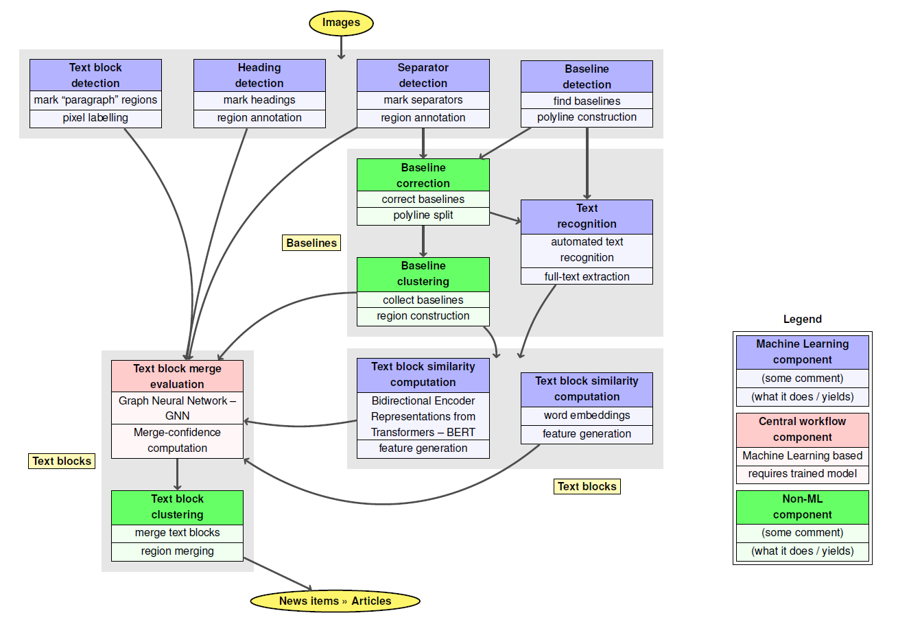

# Article Separation
!!!THIS README FILE IS WIP!!!

> Python modules for different tasks:
> - separating articles in (historical) newspapers or similar documents (`article_separation`)
> - measuring the performance of article separation algorithms (`article_separation_measure`)
> - utility functions, e.g. for plotting images together with metadata information (`python_util`)

<!-- TOC -->
## Table of Contents
* [Introduction](#introduction)
* [Installation](#installation)
* [Main Packages](#main-packages)
	* [article_separation](#article_separation)
	* [article_separation_measure](#article_separation_measure)
	* [python_util](#python_util)
* [Usage](#usage)
* [See Also](#see-also)
<!-- TOC -->

## Introduction
This repository is part of the European Union's Horizon 2020 project [NewsEye](https://www.newseye.eu/) and is mainly 
used for separating articles in (historical) newspapers and similar documents. 

The  purpose  of  the  NewsEye  project  is  to  enable  historians  and  humanities  scholars  to  investigate
a great amount of newspaper collections. The newspaper pages are digitized and are available as scanned images. 
To ensure efficient work, the data processing steps should be as automatic as possible. Generally, newspapers are 
structured into large numbers of articles.  These usually contain a distinct piece of content or describe a certain
topic and can mostly be understood without any context. Newspaper articles are crucial entities for historians and 
humanities scholars who focus on a specific research area and are only interested in articles related to that topic. 
Additionally, some natural language processing applications, like e.g. topic modeling or event detection, rely on a 
logical structuring of the underlying text, to be able to extract meaningful information. For this reason it is 
important to tackle the article separation (AS) task, which tries to form coherent articles, based on previously detected
baselines and their respective text.

In the following image a schematic overview of the overall AS workflow can be found.



## Installation
The Python modules in this repository are all tested with Python 3.6. The best way to use the modules is by creating
a virtual environment and install the packages given in the `requirements.txt` file.

## Main Packages / Usage

All modules work with metadata information stored in the well-established 
[PAGE-XML](https://www.primaresearch.org/tools/PAGELibraries) format as defined by the Prima Research group. Some
modules require the following folder structure, where PAGE-XML files are stored inside a separate page folder and should 
have the same basename as the image.

```
.
+-- file1.jpg
+-- file2.jpg
+-- file3.jpg
+-- page
|	+-- file1.xml
|	+-- file2.xml
|	+-- file3.xml
```

### article_separation
The most important package is `article_separation` where all scripts can be found to run AS-related tasks. A brief 
description of all modules that can be used in this repository is given in the following. A more detailed description of 
the workflow can be found in the official public deliverable D2.7 (*Article separation (c) (final)*). A link to all 
public deliverables is given [here](https://cordis.europa.eu/project/id/770299/results).

#### Separator Detection
This module is used to detect visible vertical and horizontal separators on a newspaper page. To use it a TensorFlow 
model is needed that was trained on an image segmentation task. The underlying model we used is the so called 
[ARU-Net](https://arxiv.org/abs/1802.03345) which is a U-Net extended by two key concepts, attention (A) and
depth (residual structures (R)). To run the separator detection use the `run_net_post_processing.py` file like in the 
following example.

```bash
python -u run_net_post_processing.py --path_to_image_list "/path/to/image/list" --mode "separator" --num_processes N
```

#### Text Block Detection
The current version of this module is divided into two parts and only needs the PAGE-XML files:
1. Cluster the text lines / baselines on a page based on the [DBSCAN](https://en.wikipedia.org/wiki/DBSCAN) algorithm.
2. Based on these clusters create text regions with the [Alpha shape](https://en.wikipedia.org/wiki/Alpha_shape)
   algorithm.
   
The corresponding run scripts are `run_baseline_clustering.py` and `run_textregion_detection.py` which can be run as in 
the following example.

```bash
python -u run_baseline_clustering.py --path_to_xml_lst "/path/to/xml/list" --num_threads N
python -u run_textregion_generation.py --path_to_xml_lst "/path/to/xml/list" --num_threads N
```
#### Heading Detection
The heading detection combines a distance transformation for detecting approximate text heights and stroke widths with 
an image segmentation approach that detects headings in an image. The results of both approaches are combined in a 
weighted manner where most weight is put on the net output. To run the heading detection use the 
`run_net_post_processing.py` file like in the following example.

```bash
python -u run_net_post_processing.py --path_to_image_list "/path/to/image/list" --mode "heading" --num_processes N
```
#### Graph Neural Network

### article_separation_measure
This package contains a method to measure the performance of an AS algorithm. It is based on the baseline detection 
measure that was already used at competition like the *ICDAR 2017 Competition on Baseline Detection* and a description 
of it can be found [here](https://arxiv.org/pdf/1705.03311.pdf). The AS measure was used at the [*ICPR 2020 Competition 
Text Block Segmentation on a NewsEye Dataset*](https://link.springer.com/chapter/10.1007%2F978-3-030-68793-9_30). A more 
detailed description can be found in the public deliverable D2.7.

To run the measure you need a list of hypothesis PAGE-XML files and a list of ground truth PAGE-XML files you want to 
compare to. The run script is given by `run_measure.py` and can be executed as in the following example.

```bash
python -u run_measure.py --path_to_hyp_xml_lst "/path/to/hyp/xml/list" --path_to_gt_xml_lst "/path/to/gt/xml/list"
```

### python_util
This package contains multiple utility functions that are used by the `article_separation` package. The most important 
ones are the PAGE-XML parser (`page.py`) and the PAGE-XML plotter (`plot.py`) to load and save the metadata information 
related to an image.

## See Also
- Main NewsEye GitHub page: https://github.com/newseye
- Transkribus GitHub page: https://github.com/Transkribus
- ARU-Net GitHub page: https://github.com/TobiasGruening/ARU-Net
